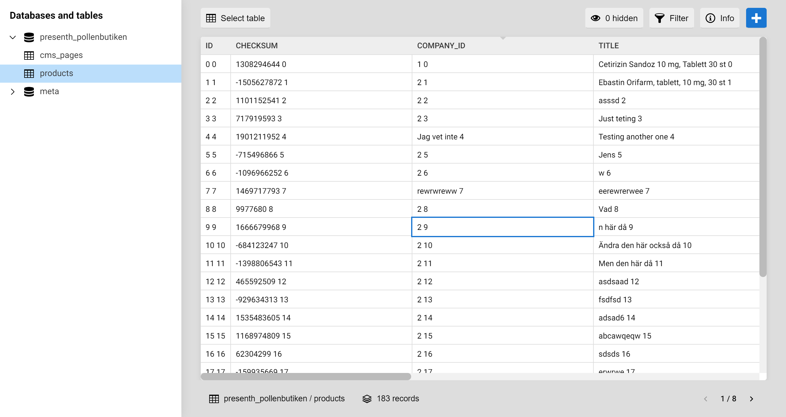

# [ Squares ]

*Version: Unreleased*

## Make databases fun!

When building complex projects with a custom database, editing the data can be a pain. With Squares, it is as simple as editing a spreadsheet.

## Screenshot

## Features

- Spreadsheet like table
- Select table from multiple databases
- Show/hide colums
- Filter rows
- Get info about the table (size, rows etc)
- Add and delete rows
- Pagination
- Different field types
- Plugin support

## Answers

### Difference between Squares and phpMyAdmin

With phpMyAdmin you can create tables and run SQL queries. You can't do these things with Squares. The downside in my opinion is that phpMyAdmin does no longer feel modern and does not have a great user experience.

Squares is more focused around editing the data with already created tables. It should be really easy to step between different cells and edit the data completely without hassle. Squares also provide more field types, like checkboxes and markdown.

### Difference between Squares and CMSes

Different field types can be seen in html5, in forms but also in CMSes. Squares have different field types as well. It's still not a form or a CMS.

- In a CMS you are editing pages. In Squares, you edit tables and table cells.
- In a CMS you have functions and classes to create a site. Squares can not be used to build a site. It has no functions and no classes for site building.

If you have a complex project, where you need to edit the database tables directly without hassle, use Squares. If you want to build a site, use a CMS. [Kirby](https://getkirby.com/) is an excellent choice for that.

## Competitors

### phpMyAdmin

Like all software there are competition. Almost everyone that needs to edit a database table uses phpMyAdmin so that is probably my biggest competition. At the same time, with Squares you can't create new tables and not handle SQL queries so at least initially phpMyAdmin is still needed.

### Tableplus

The most similar software I have found is Tableplus. It's a really fast desktop application and I really like it. What I miss is the more complex field types like markdown in the Windows version.

## Non competitors

### CMSes

WordPress, Kirby and other CMSes does not compete with Squares. Simple because these tools are made for different things.

I actually have a vague plan to make Squares a plugin for Wordpress, Kirby, Drupal etc. To have both the traditional CMS admin but also a nice way to edit the data inside the database tables would be really neat, I think.

### Airtable, Handsontable and Spreadsheet

I'm heavily inspired by these services. However, they can never be competitors because they are not made for editing self hosted database tables. They are made for editing data and store it in the cloud.

## Libraries used

- https://icomoon.io/#preview-free
- https://vuejs.org/
- https://vuex.vuejs.org/
- https://router.vuejs.org/

## Inspiration

- https://tableplus.io/
- https://handsontable.com/examples
- https://airtable.com/
- https://spreadsheets.google.com

## Donate

Donate to [DevoneraAB](https://www.paypal.me/DevoneraAB) if you want.

## License

Free so far