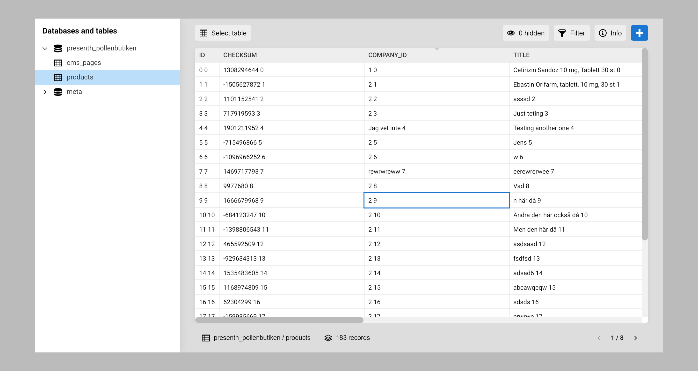

# [ Squares ]

*Version: Unreleased*

## Fun with databases!

When building complex projects with custom databases, editing the data can be a pain. With Squares, it's as simple as editing a spreadsheet.

## Screenshot

*Unpolished screenshot*

## Features

- Spreadsheet like table
- Select table from multiple databases
- Get info about the table
- Add and delete rows
- Edit cells with different field types
- Show/hide colums
- Filter rows
- Pagination
- Plugin support

## Differences to phpMyAdmin

Below is an incomplete comparison table, just to show some major differences between the two.

| Feature          | phpMyAdmin | Squares |
| ---------------- | ---------- | ------- |
| Create tables    | Yes        | -       |
| Run SQL queries  | Yes        | -       |
| Field types      | -          | Yes     |
| Spreadsheet UI   | -          | Yes     |

In conclusion, [phpMyAdmin](https://www.phpmyadmin.net/) is a feature rich tool, while Squares is focused on editing the data with a great user experience.

## Squares is not a CMS

Different field types can be seen in html5, in forms but also in CMS. Squares also have different field types. It's still not a form or a CMS.

- In a CMS you are editing pages. In Squares, you edit table cells.
- In a CMS you have functions and classes to create a site. Squares can not be used to build a site. It has no functions and no classes for site building.

If you have a complex project, where you need to edit the database tables directly, use Squares.

If you need to build a site, use a CMS. [Kirby](https://getkirby.com/) is an excellent choice for that.

### Inspired by Spreadsheets, Airtable and Tableplus

I'm heavily inspired by these tools, how they work and how they look.

[Spreadsheets](https://spreadsheets.google.com) and [Airtable](https://airtable.com/) can however never compete, because they are not made for editing self hosted database tables. They are made for editing data and store it in the cloud.

[Tableplus](https://tableplus.com/) however is a competitor as it's ment to solve the exact same problems as Squares. It still lack some features like markdown support in the Windows version.

## Libraries used

- https://icomoon.io/#preview-free
- https://vuejs.org/
- https://vuex.vuejs.org/
- https://router.vuejs.org/

## Inspiration

- https://tableplus.io/
- https://handsontable.com/examples
- https://airtable.com/
- https://spreadsheets.google.com

## Donate

Donate to [DevoneraAB](https://www.paypal.me/DevoneraAB) if you want.

## License

Free so far